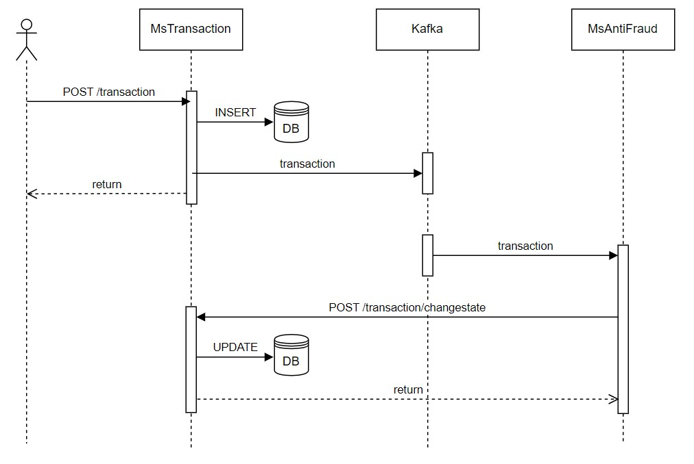
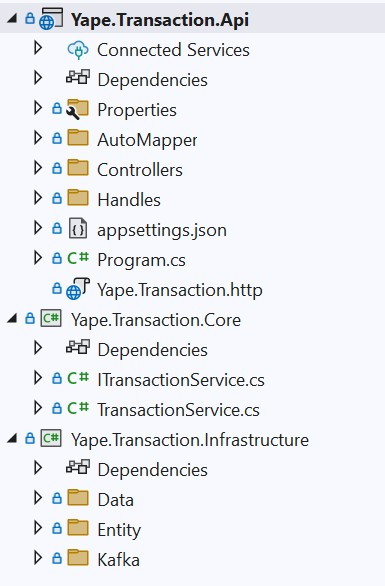
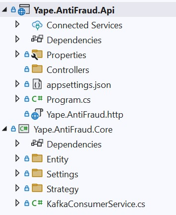

# Evaluacion Tecnica

### Descripcion

Permitir registrar transacciones que seran evaluada mediante reglas anti-fraude 

### Arquitectura

La implementacion esta compuesta de dos microservicios los cuales interactuan de forma asincrona usando Kafka para implementar la cola de mensajes.

### MsTransaction

Recibira la transacion que sera registrada y enviada al servicio de fraude para ser evaluada.

Se estructura en 3 proyectos de los caules:

- **Api**: Es la capa de interacion que espone el servicio mediante http
- **Core**: Define la logica de negocio mediante servicio
- **Infrastructure**: Brinda soporte a Core para interacturar con servicio externos como ser base de datos o colas

Librerias utilizadas

- **Mediator**: Permite implementar el patron de comandos para ordenar las acciones que llegan a la capa Rest Api
- **AutoMapper**: Transforma objetos entre las diferentes capas de la solucion.

### MsAntiFraud

Recibe la transaccion mediante la lectura de una cola implementada en Kafka y evalua si la transaccion pasa las reglas.

Las reglas se implementan mediante el patron Strategy el cual permite definir reglas que pueden ampliarse a medida que la solucion evoluciones

Se estructura en 2 proyectos:

- **Api**: Este servicio no expone funcionalidad mediante protocolo http, esta capa solo brinda soporte para permitir mantener el listener a las cola en Kafka. 
            Lo correcto seria no implementar este proyecto mediante un servicio de cloud, como ser: AWS Lambda o Azure Function, los cuales esten esculando la entrada de mensajes.
- **Core**: Implementa el consumer que escucha los mensajes que ingresan a la cola. Al recibir un mensajes lo hace pasa por las reglas de negocio implementadas mediante el patron Strategy.

