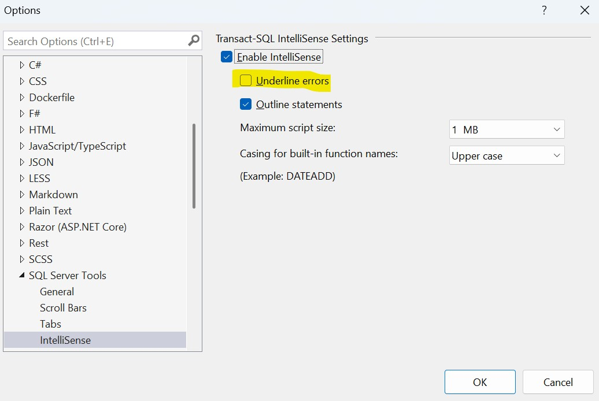
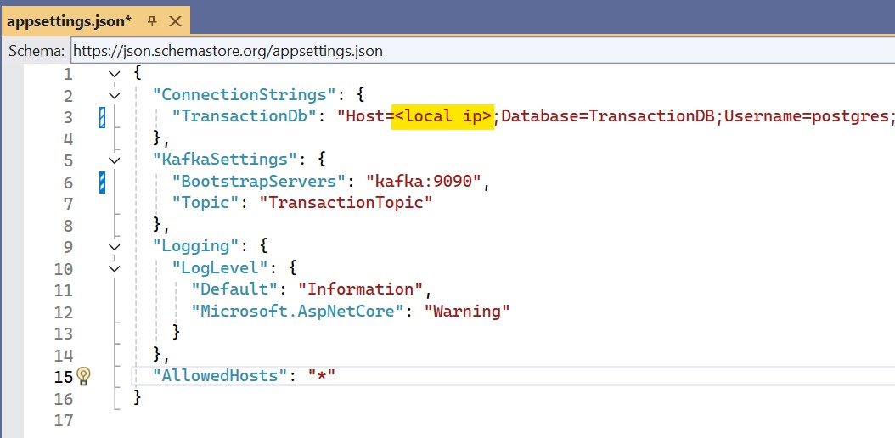
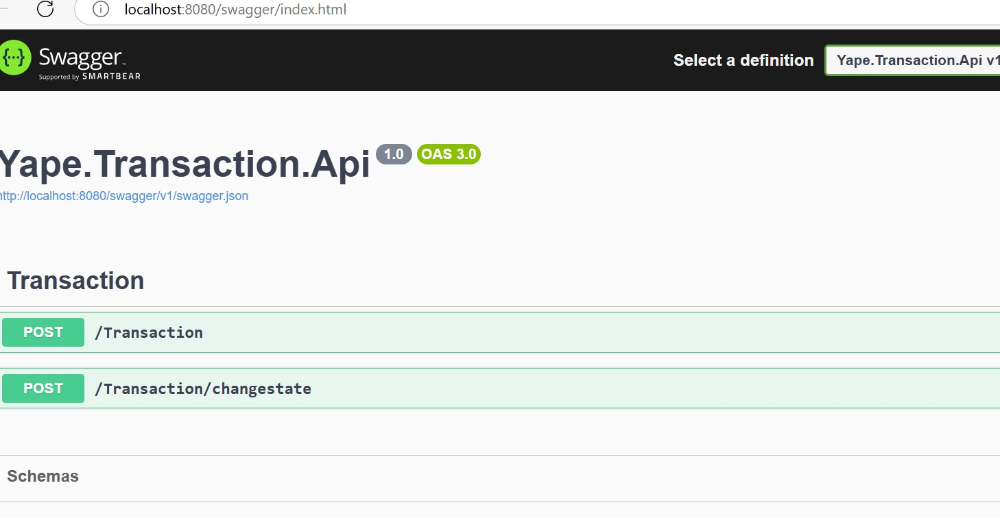
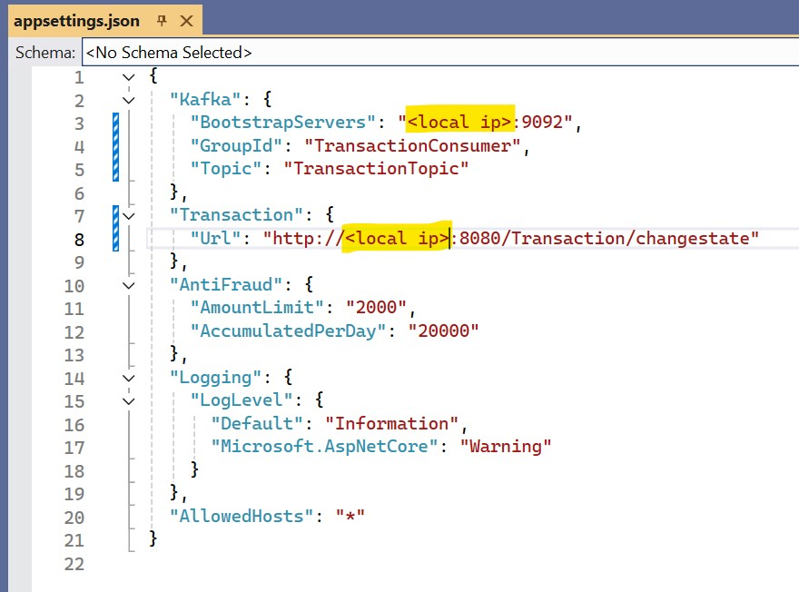

# Evaluacion Tecnica

### Descripcion

Permitir registrar transacciones que seran evaluada mediante reglas anti-fraude 

### Arquitectura

La implementacion esta compuesta de dos microservicios los cuales interactuan de forma asincrona usando Kafka para implementar la cola de mensajes.

### MsTransaction

Recibira la transacion que sera registrada y enviada al servicio de fraude para ser evaluada.

Se estructura en 3 proyectos de los caules:

- **Api**: Es la capa de interacion que espone el servicio mediante http
- **Core**: Define la logica de negocio mediante servicio
- **Infrastructure**: Brinda soporte a Core para interacturar con servicio externos como ser base de datos o colas

Librerias utilizadas

- **Mediator**: Permite implementar el patron de comandos para ordenar las acciones que llegan a la capa Rest Api
- **AutoMapper**: Transforma objetos entre las diferentes capas de la solucion.

#### <ins>Compilación</ins>

Se requiere tener instalado Docker Desktop instalado en la PC donde se ejecute el proyecto

Si se presentan mensajes de error relacionados con el archivo .sql, se relaciona al Visual Studio validando la sintaxis en base a Sql Server,
para evitar este error se debe quitar la marcar la opcion

Ante de ejecutar se debera cambiar la opcion

ingresando la IP local de la pc, por ejemplo 192.x.x.x.
Se puede obtener esa ip utilizando el comando ipconfig

Nota: No funciona si se utiliza localhost o 127.0.0.1

#### <ins>Ejecución</ins>

Al ejecutar mediante el boton "Docker Compose" en  Visual Studio se crearan las imagenes y levantaran los contenedores de cada servicio.

Postgre: mediante al script se creara la tabla de transacciones
Kafka: mediante configuracion de docker compose se creara el Topic

Al levantar el proyecto de Transaccion se deberia observar swagger en el browser.

Se puede hacer invocar el servicio mediante el uso de la opcion del propio swagger.

### MsAntiFraud

Recibe la transaccion mediante la lectura de una cola implementada en Kafka y evalua si la transaccion pasa las reglas.

Las reglas se implementan mediante el patron Strategy el cual permite definir reglas que pueden ampliarse a medida que la solucion evoluciones

Se estructura en 2 proyectos:

- **Api**: Este servicio no expone funcionalidad mediante protocolo http, esta capa solo brinda soporte para permitir mantener el listener a las cola en Kafka. 
            Lo correcto seria no implementar este proyecto mediante un servicio de cloud, como ser: AWS Lambda o Azure Function, los cuales esten esculando la entrada de mensajes.
- **Core**: Implementa el consumer que escucha los mensajes que ingresan a la cola. Al recibir un mensajes lo hace pasa por las reglas de negocio implementadas mediante el patron Strategy.

#### <ins>Compilación</ins>

Ante de ejecutar se debera cambiar la opcion

ingresando la IP local de la pc, por ejemplo 192.x.x.x.
Se puede obtener esa ip utilizando el comando ipconfig

Nota: No funciona si se utiliza localhost o 127.0.0.1

#### <ins>Ejecución</ins>

Al ejecutar mediante el boton "Docker Compose" en  Visual Studio se crearan las imagen y levantara un unico contenedores.

Kafka: Creara un consumer, pero el topic y servicio utiliza el que crear se crea desde la solucion de Transaction

